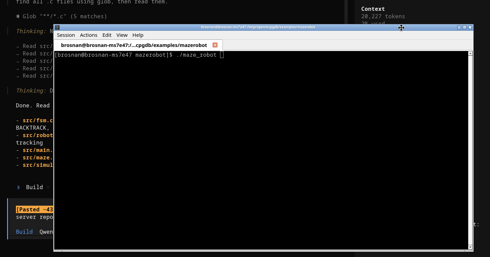

# openmcpgdb



`openmcpgdb` is an asynchronous Rust MCP server for debugging native programs through GDB.
It is implemented with the `rmcp` crate and exposes a full `gdb_*` tool API for MCP clients (Codex, Claude Code, opencode-compatible clients).

## Features

- MCP server built with `rmcp` (`tools/list`, `tools/call` support).
- One dedicated worker thread per MCP client session.
- GDB process isolation per client.
- Configurable display windows for source, backtrace, and watched variables.
- Transport modes:
  - `stdio://` (default): MCP over stdin/stdout for direct client registration
  - `http://...` and `https://...`: streamable HTTP mode for remote/shared use
- Interactive MCP test client binary included.
- Rust tests include:
  - in-process MCP server/client connectivity
  - tool-call coverage
  - integration test against `examples/mazerobot/maze_robot`

## Quick Start 

1. Download and Run

```bash
git clone https://github.com/BrosnanYuen/openmcpgdb.git
cd openmcpgdb
# Optional: create a config.json to override defaults (all fields are
# optional; an empty {} config is valid)
vim config.json
# Run MCP server (stdio transport by default, gdb resolved from PATH)
cargo run --bin openmcpgdb
```

2. Add to Claude Code `claude.json`
```json
{
  "mcpServers": {
    "openmcpgdb": {
      "type": "http",
      "url": "http://localhost:9443"
    }
  }
}
```

3. Add to Openai Codex `config.toml` config
```
[mcp_servers.openmcpgdb]
url = "http://localhost:9443"
enabled = true
```

4. Add to `opencode.json` config
```json
{
  "$schema": "https://opencode.ai/config.json",
  "mcp": {
    "openmcpgdb": {
      "type": "remote",
      "url": "http://localhost:9443",
      "enabled": true
    }
  }
}
```

5. Give short version guide [LLM_short.md](LLM_short.md) to your LLM. If it doesn't work then use long version [LLM.md](LLM.md)

## Requirements

- Rust toolchain (stable)
- GDB available on `PATH` (or set `gdb_path` to its absolute location)
- Linux/macOS environment for the provided examples

## Project Layout

- `src/main.rs`: server entrypoint
- `src/runtime.rs`: transport/runtime bootstrapping
- `src/server.rs`: MCP tool routing and handlers
- `src/session.rs`: per-client worker thread and operation execution
- `src/gdb.rs`: real and mock GDB backends
- `src/bin/interactive_client.rs`: interactive MCP client
- `tests/mazerobot_mcp_client.rs`: integration MCP client test against mazerobot
- `config.json`: default config template

## Configuration

A JSON config file is loaded **only** when its path is passed as the first CLI argument. With no argument the server starts with built-in defaults — it never reads `./config.json` implicitly, so behavior is identical regardless of working directory (important for MCP client registration).

- Run `openmcpgdb --help` for usage.
- Every field is optional; an empty `{}` config is valid.
- Relative paths (`gdb_path` command names, `codebase_dir`, `executable_path`) are resolved at startup: bare commands via `PATH`, directories/files against the working directory. After resolution all paths become absolute.

> **Note on error reporting:** tools report failure through the structured
> payload — `debugger_state: "error"` plus an `error` message — while the MCP
> transport-level `isError` flag stays `false`. Clients should inspect
> `debugger_state`, not only `isError`.

Example (only overrides what differs from the defaults):

```json
{
  "gdb_path": "/usr/bin/gdb",
  "gdb_options": "",
  "codebase_dir": "/path/to/project",
  "executable_path": "/path/to/project/target/debug/app",
  "mcp_server_name": "MCP GDB Server",
  "mcp_server_url": "stdio://",
  "display_lines_before_current": 7,
  "display_lines_after_current": 8,
  "display_backtrace": 50,
  "display_variable_list": 20,
  "display_join_current_code": true
}
```

Defaults:

| Field | Default |
| --- | --- |
| `gdb_path` | `"gdb"` (resolved via `PATH`) |
| `gdb_options` | `""` |
| `codebase_dir` | current working directory |
| `executable_path` | unset (`gdb_execute` receives the binary per call) |
| `mcp_server_name` | `"MCP GDB Server"` |
| `mcp_server_url` | `"stdio://"` |
| `display_lines_before_current` | `7` |
| `display_lines_after_current` | `8` |
| `display_backtrace` | `6` |
| `display_variable_list` | `9` |
| `display_join_current_code` | `false` |

`display_join_current_code` controls how `current_code` is returned:
- `false`: object map keyed by line number
- `true`: single joined string in the format `line | source` with newline separators

### `mcp_server_url`

- Default: `stdio://` — MCP over stdin/stdout, the standard transport for registering the server with MCP clients.
- `http://host:port/path` or `https://host:port/path`: run streamable HTTP on that bind address/path.

Note: `https://` is parsed and accepted, but this project currently binds plain TCP HTTP directly. For real TLS, run behind a TLS-terminating reverse proxy.

## Build

```bash
cargo build
```

## Run the MCP Server

### 1. Default stdio mode

No config needed (or keep `mcp_server_url` at its `"stdio://"` default):

```bash
cargo run --bin openmcpgdb
```

Register the binary in your MCP client, e.g. for opencode:

```json
{
  "mcp": {
    "openmcpgdb": {
      "type": "local",
      "command": ["target/debug/openmcpgdb"],
      "enabled": true
    }
  }
}
```

### 2. HTTP/HTTPS custom URL mode

Set config URL, for example:

```json
"mcp_server_url": "https://localhost:9443"
```

Run:

```bash
cargo run --bin openmcpgdb -- config.json
```

### 3. Optional stdio mode via config

Set:

```json
"mcp_server_url": "stdio://"
```

Run:

```bash
cargo run --bin openmcpgdb -- config.json
```

## Interactive MCP Client

An interactive MCP client is included for manual testing against HTTP server mode.

Run:

```bash
cargo run --bin interactive_client -- config.json
```

Input format:

```text
<tool_name> <json-args>
```

Examples of Debugging on local GDB:

```text
gdb_execute {"executable_path":"/absolute/path/to/program"}
gdb_debugger_state {}
gdb_add_variable_list {"var":"robot->sim->robot_row"}
gdb_add_breakpoint {"location":"/absolute/path/to/file.c:20"}
gdb_add_breakpoint {"location":"*0x4005a0","condition":"count == 3"}
gdb_watch {"expression":"counter"}
gdb_run {}
gdb_next {}
gdb_step {}
gdb_print {"expression":"counter"}
gdb_examine_memory {"address":"&counter","count":4,"format":"x","size":"w"}
gdb_disassemble {"address":"main"}
gdb_frame_info {}
gdb_full_backtrace {}
gdb_continue {}
gdb_quit {}
gdb_reset_back_to_not_attached {}
```

Examples of Debugging on gdbserver on existing PID:
```
gdb_gdbserver {"ip":"127.0.0.1","port":11444,"pid":149104}
gdb_target_remote {"ip":"127.0.0.1","port":11444}
gdb_debugger_state {}
gdb_add_variable_list {"var":"robot->sim->robot_row"}
gdb_add_breakpoint {"location":"/absolute/path/to/file.c:20"}
gdb_continue {}
gdb_next {}
gdb_step {}
gdb_print {"expression":"counter"}
gdb_full_backtrace {}
gdb_quit {}
gdb_reset_back_to_not_attached {}
```

Type `quit` to exit the interactive client.

## Use With MCP Clients

This server is compatible with MCP clients that support either:
- command-based stdio servers
- streamable HTTP servers

### opencode (stdio recommended)

Use MCP server command settings pointing to:

```bash
cargo run --bin openmcpgdb
```

No config needed for `stdio://` (default). Or with an explicit config:

```bash
cargo run --bin openmcpgdb -- /absolute/path/to/config.json
```

And set in config:

```json
"mcp_server_url": "stdio://"
```

### OpenAI Codex clients

You can use either mode:

1. `stdio` mode (recommended):
- server command:
```bash
cargo run --bin openmcpgdb
```
- or with config:
```bash
cargo run --bin openmcpgdb -- /absolute/path/to/config.json
```
- config URL:
```json
"mcp_server_url": "stdio://"
```

2. HTTP mode:
- run server with:
```json
"mcp_server_url": "https://localhost:9443"
```
- connect client MCP endpoint to:
```text
http://localhost:9443
```

### Claude Code clients

For local development, prefer stdio:

```bash
cargo run --bin openmcpgdb
```

Or with config:

```bash
cargo run --bin openmcpgdb -- /absolute/path/to/config.json
```

with:

```json
"mcp_server_url": "stdio://"
```

If you use HTTP transport, point the client to:

```text
http://localhost:9443
```

### Important transport note

`https://localhost:9443` is accepted in this project config as a default URL shape, but the current server bind is plain HTTP.  
For true TLS HTTPS, run behind a TLS reverse proxy and expose an HTTPS endpoint there.

## Tool API

All tool responses include `debugger_state` and may include `stop_reason`, `variable_list`, `backtrace`, `current_code*`, `current_func`, `breakpoints`, `memory`, `command_output`, and `error`. See `LLM.md` for the full reference.

### `debugger_state` values

- `not attached`
- `failed to attach`
- `gdbserver attached`
- `gdbserver failed to attach`
- `attached`
- `stopped at breakpoint`
- `stopped at stepping`
- `running`
- `sigsegv`
- `sigabrt`
- `sigbus`
- `sigfpe`
- `sigill`
- `sigtrap`
- `sigterm`
- `sigkill`
- `exited`
- `error`

### Execution/session

- `gdb_execute(executable_path)`
- `gdb_attach(pid)`
- `gdb_detach()`
- `gdb_run()`
- `gdb_gdbserver(ip, port, pid)`
- `gdb_target_remote(ip, port)`
- `gdb_set_thread(id)`
- `gdb_set_frame(id)`

### Breakpoints & watchpoints

Locations accept any GDB form: `"file.c:55"`, `"function"`, `"file.c:function"`, `"symbol+16"`, `"*0x4005a0"`. Breakpoint `target` is a breakpoint number (`"1"`, `"2.1"`) or a location string. `condition` is an optional GDB expression.

- `gdb_add_breakpoint(location, condition?)`
- `gdb_clear_breakpoint(target)`
- `gdb_enable_breakpoint(target)`
- `gdb_disable_breakpoint(target)`
- `gdb_list_breakpoint()` — structured `{number, kind, enabled, detail}`
- `gdb_watch(expression, mode?)` — `write` (default), `read`, `access`

### Stepping

- `gdb_next()` — step over
- `gdb_step()` — step into
- `gdb_nexti()` / `gdb_stepi()` — instruction-level
- `gdb_finish()` — run until current function returns
- `gdb_continue()`
- `gdb_interrupt()`

### Variable watch list

- `gdb_add_variable_list(var)`
- `gdb_del_variable_list(var)`
- `gdb_variable_list()`

### Inspection

- `gdb_debugger_state()`
- `gdb_current_code()`
- `gdb_full_backtrace()`
- `gdb_info_threads()`
- `gdb_info_regs()`
- `gdb_print(expression)` — any GDB expression: casts, derefs, arithmetic
- `gdb_set_var(var, value)`
- `gdb_frame_info()` — `info args` + `info locals`
- `gdb_disassemble(address?)` — current function or around symbol/address
- `gdb_examine_memory(address, count?, format?, size?)` — `x/<count><format><size> <address>`, `memory` map + raw dump

### Control/config/custom

- `gdb_quit()`
- `gdb_kill()`
- `gdb_reset_back_to_not_attached()`
- `gdb_set_display(lines_before_current?, lines_after_current?, backtrace?, variable_list?)`
- `gdb_custom(cmd)` — raw GDB command

## Testing

Run all tests:

```bash
cargo test
```

Included test coverage:

- MCP server starts and MCP client connects.
- Unit-style all-tool-call response checks.
- Integration test starting MCP server with:
  - codebase: `examples/mazerobot/`
  - binary: `examples/mazerobot/maze_robot`
  - MCP client in `tests/mazerobot_mcp_client.rs`

